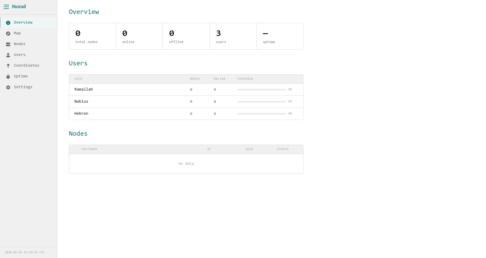
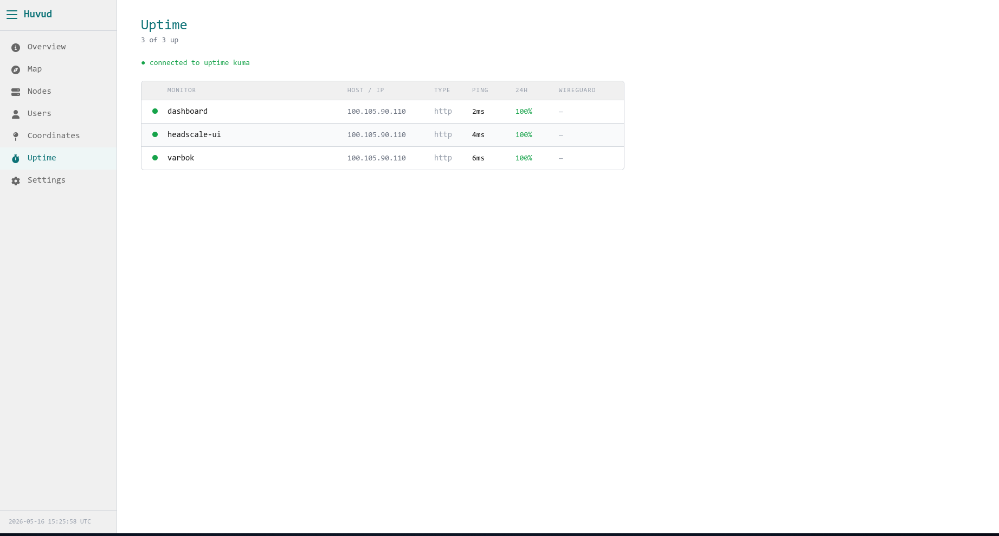
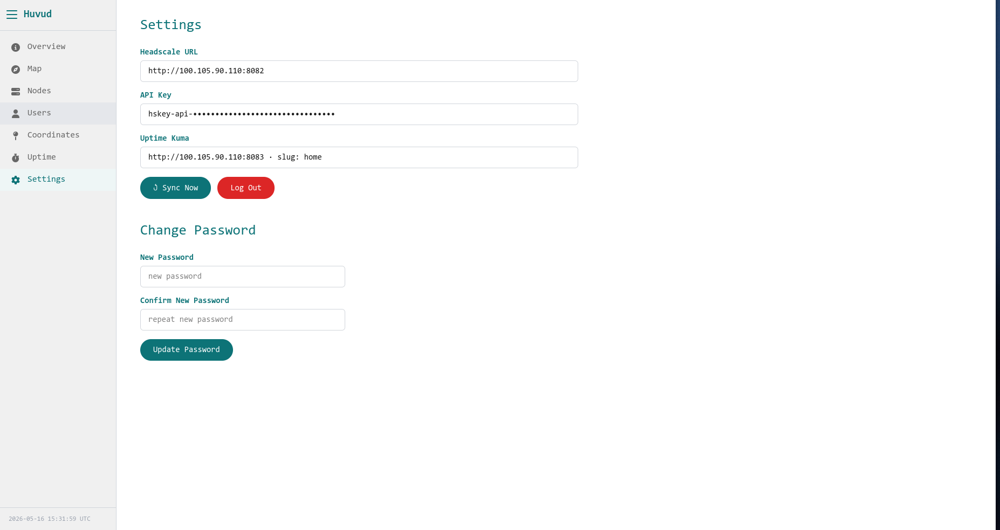

# Huvud

A self-hosted network operations dashboard for the West Bank hospital mesh. Built with React, pulls live data from Headscale and Uptime Kuma, renders a real map with Leaflet, and runs fully in-browser with no backend of its own.

---

## Tabs

### Overview

The landing summary. Shows total nodes, online/offline count, uptime percentage, and user count at a glance. Below that, a user coverage table with a progress bar per user, and a full node list at the bottom.



---

### Map

A live OpenStreetMap with a pin for every configured node.

- **Green**: node is registered and online
- **Red**: node is registered and offline
- **Gray**: location is configured in `nodeLocations.js` but the node hasn't joined yet

Click any pin to see hostname, IP, user, status, and exact coordinates. The right panel lists all pins — clicking one flies the map to that location.

The map loads even with zero registered nodes.


---

### Nodes

A searchable table of all registered nodes. Filter by name, IP, or user. 
Click any row to expand a full detail panel showing hostname, IP, user, role, status, last seen timestamp, tunnel type, and GPS coordinates (if configured).

---

### Users

One section per Headscale user. Shows a coverage progress bar and a node table per user.
Users with no nodes show an empty state.
New users appear automatically when you create them in Headscale.

---

### Coordinates

Shows all configured node locations with their exact GPS coordinates and live status.
Highlights any registered nodes that don't have coordinates yet, those fall back to their user's center on the map.

---

### Uptime

Pulls live data from Uptime Kuma — shows all monitors with ping, 24h uptime percentage, monitor type, and host/IP. The WireGuard column fills in automatically when a Headscale node with a matching hostname joins the mesh. Refreshes every 30 seconds.



---

### Settings

Server configuration, sync controls, and password change.
Log out clears all credentials from the browser.




---

## Node Naming Convention

Huvud parses hostnames automatically to assign nodes to users and roles.

```
<user>-<role>-<number>
tyrell-admin-1
bjorn-user-3

```

No manual assignment needed, the name drives everything.

---

## Coordinates

Get coordinates by right-clicking a location on Google Maps and copying them. Nodes without an entry fall back to their user's center on the map.

---

## Configuration

Edit `src/constants.js`:

```js
export const UPTIME_KUMA_URL  = "http://<your-server-ip-or-ns>:8083";
export const UPTIME_KUMA_SLUG = "your-status-page-slug" (e.g homelab);
```

Headscale URL and API key are entered on first login and stored locally in the browser — they're never in the source code.

---

## Running

```bash
npm install
npm run dev
npm run build
cp -r dist/* ../dashboard/
sudo docker compose restart dashboard
```

---

## Stack

| piece | what it does |
|---|---|
| React | UI framework |
| Leaflet.js | Map rendering via OpenStreetMap |
| Headscale API | Source of truth for nodes and users |
| Uptime Kuma API | Ping, uptime %, and monitor status |
| nginx | Serves the built app + CORS proxy to Headscale and Uptime Kuma |
| Docker Compose | Runs alongside Headscale, Headscale UI, Uptime Kuma |
